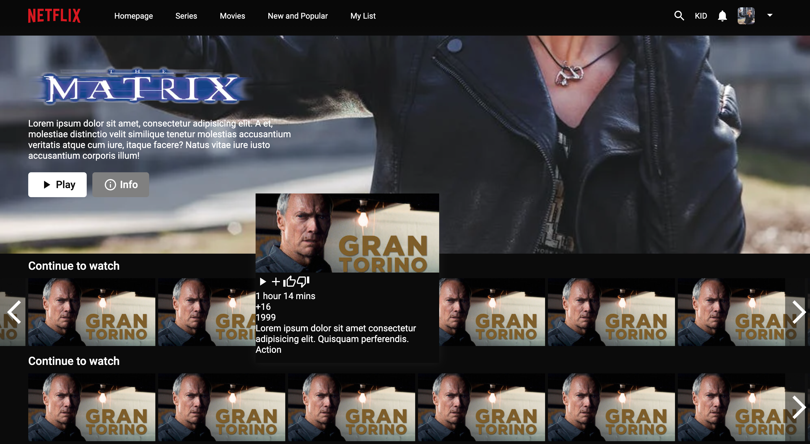
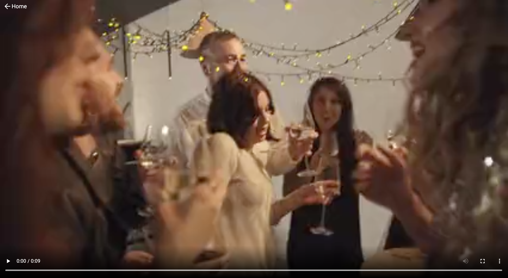

# Netflix Replica
Link to project deployed with netlify. Live demo [here](https://abeers-netflix.netlify.app/)

## Table of Content
* General Information
* Technologies Used
* Features
* Screenshot
* Installation and Setup Instructions
* Usage
* Project Status
* Room for Improvement
* Acknowledgements
* Contact

## General Information
I created this Netflix replica app that shows a register page, a login page, a home page, and a watch page. This project uses react-routing, MUI, SCSS and react hooks such as: useRef/useState.

### Purpose of this project
To practice web design and routing.

## Technologies Used
* ReactJS
* HTML
* CSS
* JavaScript
* Material UI
* React Hooks
* Webkit

## Features
* React-routing.
* A Register page. 
* A Login page => to access add: /login
* A Home page => to access add: /login/any id e.g. 123
* A watch page => to access add: /login/any id e.g. 123/watch
* A dynamic Start button in Register page.

## Screenshot
Register Page

Login Page

Home Page

Home Page (Scrolled)

Watch Page - Light Mode

## Installation and Setup Instructions

Clone down this repository. You will need node and `npm` installed globally on your machine.

### Installation:

`npm install`

To Run Test Suite:

`npm test`

To Start Server:

`npm start`

To Visit App:

`localhost:3000/`

## Usage

**Register Page**

* The register page mimics that of the original Netflix website.

**Register Page Start Button**

* Once the user enters their email or phone number they will be propmted to enter their password.

**Login Page**

* The login page mimics that of the original Netflix website.

**Home Page**

* The home page mimics that of the original Netflix website. Hovering your mouse over the movie cards will play the movie trailer as well as show the movie information.

**Watch Page**

* The watch page mimics that of the original Netflix website, and carries the video player.

**URL Routing**

* To access all website pages look URL extensions in features.

## Project Status
Project is: Completed

## Room for Improvement
* Make all buttons dynamic.
* Add authentication page. 
* Add styling to the composite layer to prevent the trailer from lagging. (see article [here](https://medium.com/outsystems-experts/how-to-achieve-60-fps-animations-with-css3-db7b98610108)

## Acknowledgements
* Many thanks to LamaDev.

## Contact
Created by Abeer Ahmed [LinkedIn profile](add url) - feel free to contact me.

